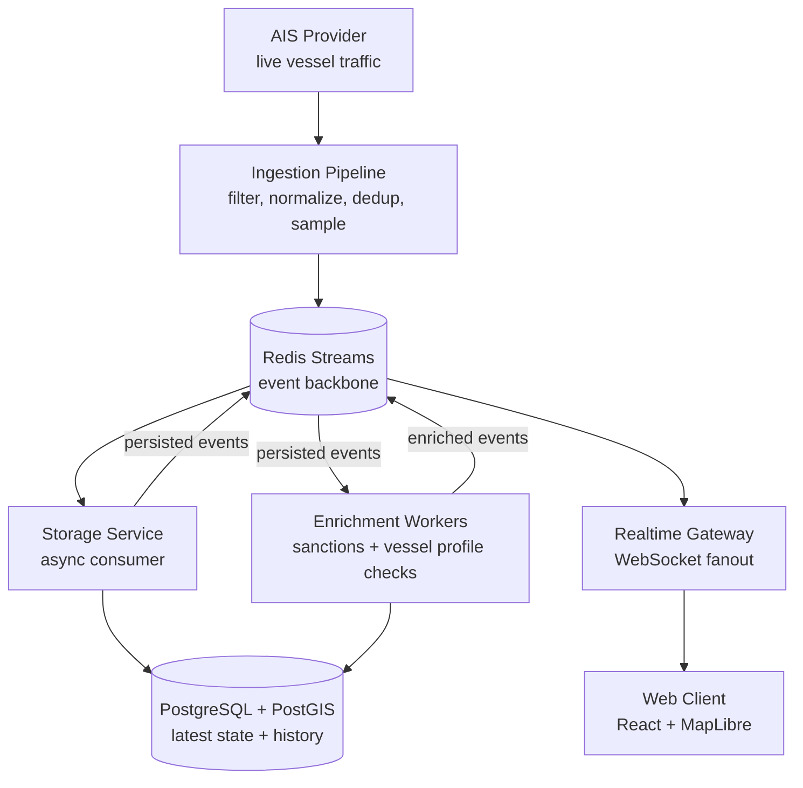
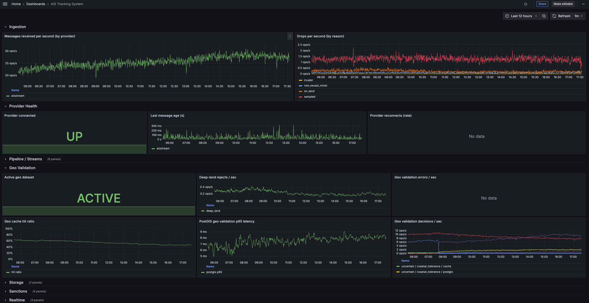
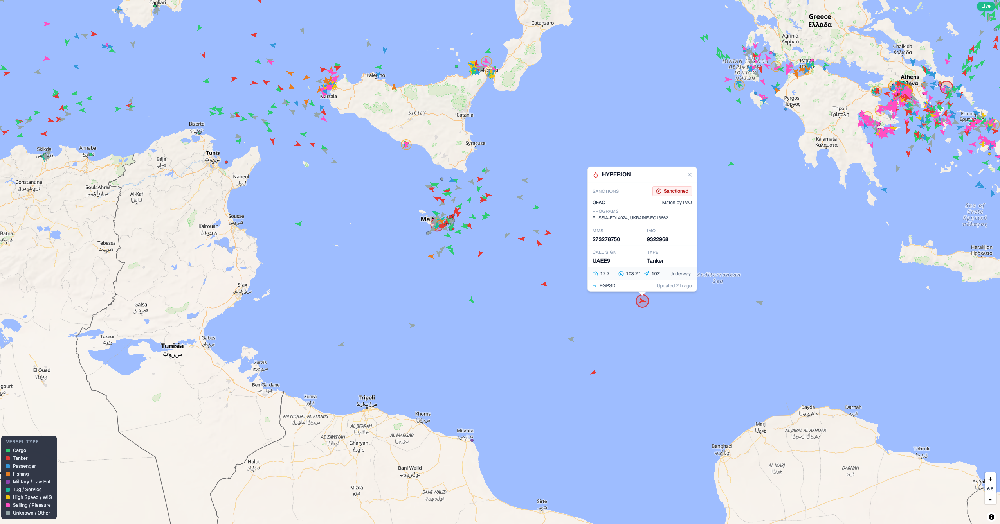

# AIS Tracking System


Production-style AIS vessel tracking backend for realtime ingestion, event-driven processing, geospatial querying, sanctions enrichment, and operational observability.

The system ingests live AIS traffic, normalizes provider-specific messages into canonical events, persists current and historical vessel state in PostGIS, enriches vessels against sanctions data, and streams realtime updates to a MapLibre web client.

**Live Demo:** [aiswatch.live](https://aiswatch.live)

## Motivation

This project was built as a solo backend engineering effort to explore the shape of a production-style realtime data system: ingestion, contracts, async processing, geospatial storage, reliability boundaries, and observability.

The focus is intentionally backend and system design. The map UI is a useful client, but the main work is the pipeline behind it: moving noisy live data through durable queues, storage, enrichment, and realtime delivery without turning the codebase into premature microservices.

## Key Highlights

- AISStream provider adapter with raw filtering, reconnect backoff, and feed health reporting.
- Versioned Zod contracts for position, static, persisted, and enrichment events.
- Redis Streams reliability layer with `XAUTOCLAIM`, retry accounting, DLQ, and manual replay.
- Deduplication, adaptive sampling, coverage filtering, and optional PostGIS geo validation.
- Transactional PostGIS writes for vessel identity, latest position, and historical tracks.
- Realtime fanout with bounded WebSocket queues and slow-client protection.
- OFAC SDN sanctions import plus deterministic matching by IMO, MMSI, and normalized name.
- Role-based runtime model: `api`, `ingestion`, `worker`, or full local `all`.

## System Characteristics

- Coverage area: configured Mediterranean and Black Sea AIS zones, including the Black Sea, Levant/East Mediterranean, Central/East Mediterranean, and West Mediterranean/Europe.
- Live AIS ingestion is built around stream-backed processing, role-based workers, and provider boundaries that can support broader coverage and additional AIS providers as workload grows.
- Redis Streams event backbone with consumer groups for storage, realtime fanout, and enrichment handoff.
- PostGIS-backed latest-state queries plus append-only, daily partitioned vessel history.
- WebSocket realtime updates with per-client bounded queues and position coalescing.
- Local sanctions ETL and asynchronous vessel enrichment using BullMQ workers.
- Prometheus metrics, structured logs, health/readiness checks, Grafana dashboards, and CI/CD.

## Architecture

The README diagram shows the system shape only. Detailed stream, DLQ, enrichment, and operational flows live in [docs/architecture/architecture.md](docs/architecture/architecture.md).



## Realtime Map


Live vessel positions are bootstrapped from the REST API and then updated through the WebSocket fanout path.

## Engineering Focus

This repository demonstrates:

- event-driven backend architecture with durable stream boundaries;
- realtime delivery under backpressure;
- geospatial data modeling and querying with PostGIS;
- async enrichment workflows and idempotent background jobs;
- operational reliability through DLQ/replay, health checks, metrics, and logs;
- pragmatic service boundaries inside a modular monolith.

## Core Design Decisions

**Canonical contracts at the edge**  
Provider-specific AIS payloads are converted into versioned internal events before reaching shared consumers. Storage, realtime, and enrichment validate payloads independently.

**Redis Streams over direct calls**  
Ingestion does not synchronously call storage or WebSocket code. Redis Streams provide consumer isolation, pending recovery, replay capability, and a DLQ path for poison messages.

**Storage optimized by access pattern**  
`vessels` stores identity and enrichment state, `vessel_positions_latest` powers map snapshots, and `vessel_positions_history` stores append-only track data in daily partitions.

**Realtime backpressure is explicit**  
Each WebSocket client has a bounded queue. Newer positions supersede older queued positions for the same MMSI; static and enrichment messages are preserved; slow clients are disconnected.

**Enrichment is asynchronous derived state**  
Storage emits `vessel.persisted.v1` after successful writes. Enrichment jobs use deterministic IDs, cache/profile checks, freshness guards, and publish `vessel.enriched` for realtime updates.

## Tech Stack

| Area           | Technology                                                           |
| -------------- | -------------------------------------------------------------------- |
| Backend        | Node.js 22, TypeScript, NestJS                                       |
| Messaging      | Redis Streams, Redis consumer groups, BullMQ                         |
| Database       | PostgreSQL 16, PostGIS, Drizzle migrations                           |
| Realtime       | Raw `ws` WebSocket server                                            |
| Validation     | Zod                                                                  |
| Observability  | pino, prom-client, Prometheus, Grafana                               |
| Frontend       | React, Vite, MapLibre GL, Zustand                                    |
| Testing        | Jest, Testcontainers, Vitest, Testing Library                        |
| Infrastructure | Docker, Docker Compose, Nginx, GitHub Actions, GCP Artifact Registry |

## Reliability and Scalability

- Consumer groups isolate storage, realtime, and enrichment workloads.
- Failed stream handlers are retried, reclaimed with `XAUTOCLAIM`, then moved to `ais.deadletter`.
- DLQ records retain original stream metadata and can be replayed manually.
- Redis AOF, Postgres transactions, idempotent history inserts, and timestamp-guarded latest upserts reduce recovery risk.
- Partition maintenance keeps historical track storage bounded and queryable.
- Metrics cover ingestion drops, stream lag/pending, handler errors, DB activity, geo validation, enrichment, HTTP, and WebSocket behavior.



## API Snapshot

Representative endpoints:

| Endpoint                     | Purpose                                             |
| ---------------------------- | --------------------------------------------------- |
| `GET /api/vessels`           | Latest vessel snapshot for map bootstrap            |
| `GET /api/vessels/:id`       | Vessel profile, latest position, sanctions state    |
| `GET /api/vessels/:id/track` | Historical track query with optional simplification |
| `WS /ws/positions`           | Realtime position, static, and enrichment updates   |
| `GET /readyz`                | DB/Redis readiness plus feed degradation signal     |

Admin routes support DLQ inspection/replay and sanctions import operations, guarded by `x-admin-token` and blocked publicly by the production Nginx config.



## Running Locally

```bash
pnpm install
cp .env.example .env
docker compose --profile full up --build
```

Primary local services:

- API: `http://localhost:3000`
- WebSocket: `ws://localhost:3000/ws/positions`
- Prometheus: `http://localhost:9090`
- Grafana: `http://localhost:3001`

Common checks:

```bash
pnpm typecheck && pnpm lint && pnpm test
pnpm test:integration
pnpm --dir web test
```

Set `AISSTREAM_API_KEY` in `.env` for live ingestion.

## Deployment Model

- Single backend image, selected at runtime with `PROCESS_ROLE=api|ingestion|worker`.
- Docker Compose production topology with Nginx, Postgres/PostGIS, Redis, Prometheus, and Grafana.
- One-shot migrator image for Drizzle migrations and history partition maintenance.
- GitHub Actions CI for backend/frontend quality checks, Docker image builds, Artifact Registry pushes, and approval-gated deployment.
- Operational scripts for smoke checks, rollback, Postgres backups, Redis backups, and restore drills.

## Project Map

```text
src/
  ingestion/   AIS provider adapters, filters, normalizers
  pipeline/    deduplication, sampling, geo validation, event publishing
  storage/     PostGIS schema, repositories, stream consumers
  realtime/    WebSocket gateway, fanout, bounded send queues
  enrichment/  sanctions ETL and vessel enrichment workers
  shared/      config, Redis, event bus, DB, metrics, logs, health
web/           React + MapLibre realtime client
docs/          indexed architecture, development, operations, and frontend notes
```

## Future Improvements

- Expand AIS coverage zones, add additional providers, and define explicit multi-provider failover behavior.
- Replace best-effort post-commit enrichment handoff with a transactional outbox if lossless derived-event delivery becomes required.
- Add OpenAPI generation and typed API client publishing.
- Add public API auth, rate limiting, and tenant-aware access controls.
- Evaluate scaling options for ingestion, storage consumers, and realtime fanout when workload growth justifies additional operational complexity.
- Extend sanctions sources beyond OFAC and add reviewer workflows for name-only candidate matches.

## Further Reading

- [`docs/index.md`](docs/index.md)
- [`docs/architecture/architecture.md`](docs/architecture/architecture.md)
- [`docs/architecture/architecture-decisions.md`](docs/architecture/architecture-decisions.md)
- [`docs/operations/operations-runbook.md`](docs/operations/operations-runbook.md)
- [`docs/operations/gcp-vm-runbook.md`](docs/operations/gcp-vm-runbook.md)
- [`docs/operations/https-domain-runbook.md`](docs/operations/https-domain-runbook.md)
- [`docs/operations/restore-drill.md`](docs/operations/restore-drill.md)
