# AIS Tracking System

Backend-heavy maritime intelligence system for ingesting live AIS vessel traffic,
normalizing it into a stable event contract, persisting geospatial vessel state,
screening vessels against sanctions data, and streaming realtime updates to a
MapLibre web client.

The project is intentionally shaped like a small production system rather than a
single demo script: it has explicit module ownership, Redis Streams consumer
groups, transactional PostGIS writes, replayable dead-letter handling, structured
logs, Prometheus metrics, Grafana dashboards, scheduled sanctions ETL, and a
role-based deployment model that can be split into independent services later.

## Features

- Live AISStream ingestion with provider abstraction and reconnect backoff.
- Canonical `position` and `static` event contracts validated with Zod.
- Redis Streams event bus with consumer groups, retries, `XAUTOCLAIM`, and DLQ.
- Deduplication and adaptive sampling before events reach downstream consumers.
- PostGIS storage for latest vessel positions and partitioned position history.
- REST API for vessel snapshots, vessel detail, historical tracks, and sanctions sources.
- Raw `ws` realtime gateway with per-client bounded queues and slow-client protection.
- OFAC SDN sanctions import with auditable import runs and idempotent upserts.
- Per-vessel enrichment loop using BullMQ, deterministic matching, and realtime fanout.
- JSON logging with event `traceId` correlation across ingestion, storage, realtime, and enrichment.
- Prometheus metrics and provisioned Grafana dashboard.
- React + MapLibre frontend with REST snapshot bootstrap and WebSocket merge updates.

## Architecture

The runtime is a role-sliced modular monolith. The same NestJS image can run all
modules together for local development or boot a smaller role for production-like
process separation.

```mermaid
flowchart LR
  Provider["AISStream WebSocket"] --> Adapter["Provider Adapter<br/>raw filter + health"]
  Adapter --> Normalizer["Normalizer<br/>canonical AIS events"]
  Normalizer --> Pipeline["Pipeline<br/>dedup + bbox guard + sampler"]
  Pipeline --> Events[("Redis Stream<br/>ais.events.v1")]

  Events --> Storage["storage-writer<br/>consumer group"]
  Storage --> Postgres[("Postgres + PostGIS")]
  Storage --> Persisted[("Redis Stream<br/>vessel.persisted.v1")]

  Events --> Realtime["realtime-fanout<br/>consumer group"]
  Realtime --> WS["/ws/positions"]
  WS --> Web["React MapLibre client"]

  Persisted --> PersistedConsumer["vessel-persisted consumer"]
  PersistedConsumer --> Requester["VesselEnrichmentRequester"]
  Requester --> Queue[("BullMQ<br/>enrichment.vessel")]
  Queue --> Worker["enrichment processor"]
  Worker --> Postgres
  Worker --> Enriched[("Redis Stream<br/>vessel.enriched")]
  Enriched --> Realtime
  Reconciler["VesselEnrichmentReconciler<br/>unchecked/stale fallback"] --> Requester

  SanctionsJob["scheduled sanctions import"] --> ImportQueue[("BullMQ<br/>sanctions.import")]
  ImportQueue --> Importer["OFAC adapter + importer"]
  Importer --> Postgres
```



### Process Roles

| Role        | Modules                                                        |
| ----------- | -------------------------------------------------------------- |
| `all`       | API, admin, ingestion, pipeline, storage, enrichment, realtime |
| `api`       | REST API, admin endpoints, realtime WebSocket gateway          |
| `ingestion` | provider ingestion, normalization pipeline, storage writer     |
| `worker`    | sanctions import and vessel enrichment workers                 |

This keeps the developer workflow simple while preserving extraction boundaries:
provider ingestion, API/realtime, storage consumers, and worker workloads can be
scaled or isolated independently when needed.

## Technology Stack

| Area                 | Stack                                                             |
| -------------------- | ----------------------------------------------------------------- |
| Backend runtime      | Node.js 22, TypeScript, NestJS                                    |
| Messaging            | Redis Streams, Redis consumer groups, BullMQ                      |
| Database             | PostgreSQL 16, PostGIS, Drizzle ORM/migrations                    |
| Realtime             | Raw `ws` WebSocket server                                         |
| Validation           | Zod                                                               |
| Logging              | pino / nestjs-pino                                                |
| Metrics              | prom-client, nestjs-prometheus, Prometheus                        |
| Dashboards           | Grafana provisioning                                              |
| Frontend             | React 18, Vite, MapLibre GL, Zustand, React Query, Tailwind       |
| Testing              | Jest, ts-jest, Testcontainers, Supertest, Vitest, Testing Library |
| Local infrastructure | Docker Compose                                                    |

## Core Workflows

### AIS Ingestion

1. `AisStreamAdapter` connects to AISStream with configured coverage boxes.
2. Provider-specific raw filtering rejects unsupported message types and invalid MMSIs.
3. `AisStreamNormalizer` converts accepted frames into canonical events.
4. `IngestionPipelineService` applies Redis-backed deduplication, coverage filtering,
   adaptive sampling, and `traceId` assignment.
5. Clean events are published to `ais.events.v1`.

### Storage

`StorageWriterConsumer` consumes `ais.events.v1` and validates every payload
against the canonical contract. Position events are written in one transaction:

- upsert vessel identity by MMSI,
- upsert `vessel_positions_latest`,
- append `vessel_positions_history`.

The latest table supports fast map snapshots. The history table is range
partitioned by `occurred_at` and powers the track endpoint.

After a position or static event is successfully persisted, storage publishes a
small post-persistence domain event to `vessel.persisted.v1`. Publish failures
are logged but do not fail the storage handler; enrichment is asynchronous
derived state and missed immediate events are recovered by reconciliation.

### Realtime Delivery

The frontend starts with `GET /api/vessels`, then subscribes to
`WS /ws/positions`. Realtime events are merged client-side into a Zustand store.
Each WebSocket connection has a bounded send queue:

- newer position messages supersede older queued positions for the same MMSI,
- static and enrichment messages are preserved,
- clients that cannot keep up are disconnected with an explicit error.

### Sanctions Enrichment

The sanctions subsystem is intentionally ETL-oriented. OFAC SDN vessel entries
are imported into local tables, and vessel matching happens against local data.

1. `SanctionsScheduler` enqueues a recurring `sanctions.import` job.
2. `OfacAdapter` downloads or reads SDN XML and extracts vessel entities.
3. `SanctionsImporterService` writes import audit rows and idempotently upserts entities.
4. `StorageWriterConsumer` publishes `vessel.persisted.v1` only after the
   vessel write succeeds.
5. `VesselPersistedConsumer` validates that event and calls
   `VesselEnrichmentRequester`.
6. `VesselEnrichmentRequester` owns enqueue decisions: discovered vessels,
   profile-hash changes, and missing checked-cache entries become deterministic
   BullMQ jobs; fresh vessels are skipped.
7. `VesselEnrichmentReconciler` periodically scans only unchecked or stale
   vessels and calls the same requester. It is a recovery mechanism for missed
   immediate events, not a scanner for every fresh profile change.
8. `EnrichmentProcessor` matches by IMO, MMSI, then normalized name candidate,
   applies a freshness-guarded update, and publishes `vessel.enriched`.

## API Overview

### Public HTTP

| Method | Path                                         | Purpose                                              |
| ------ | -------------------------------------------- | ---------------------------------------------------- |
| `GET`  | `/healthz`                                   | Process liveness                                     |
| `GET`  | `/readyz`                                    | DB/Redis readiness plus provider degradation payload |
| `GET`  | `/metrics`                                   | Prometheus metrics                                   |
| `GET`  | `/api/vessels?limit=&staleMinutes=`          | Latest vessel snapshot                               |
| `GET`  | `/api/vessels/:id`                           | Vessel profile, current position, sanctions state    |
| `GET`  | `/api/vessels/:id/track?from=&to=&simplify=` | Historical track, capped to 7 days                   |
| `GET`  | `/api/sanctions/sources`                     | Sanctions source metadata and last import summary    |

### Admin HTTP

Admin routes are guarded by `x-admin-token` when `ADMIN_TOKEN` is configured.
In non-development environments, an unset token disables admin access.

| Method | Path                                   | Purpose                                      |
| ------ | -------------------------------------- | -------------------------------------------- |
| `GET`  | `/admin/deadletter?stream=&limit=`     | Inspect DLQ entries                          |
| `POST` | `/admin/deadletter/:id/replay`         | Replay a DLQ event to its original stream    |
| `GET`  | `/admin/sanctions/imports`             | Inspect sanctions import runs                |
| `POST` | `/admin/sanctions/imports/:source/run` | Trigger a sanctions import, currently `ofac` |
| `GET`  | `/admin/streams`                       | Inspect known Redis Streams                  |

### WebSocket

`WS /ws/positions`

Client message:

```json
{ "type": "subscribe" }
```

Server messages:

- `{ "type": "position", "data": ... }`
- `{ "type": "static", "data": ... }`
- `{ "type": "vessel.enriched", "data": ... }`
- `{ "type": "error", "error": { "code": "...", "message": "..." } }`

## Database Model

| Table                      | Ownership          | Purpose                                    |
| -------------------------- | ------------------ | ------------------------------------------ |
| `vessels`                  | storage/enrichment | Vessel identity, profile, sanctions status |
| `vessel_positions_latest`  | storage            | One current geospatial row per vessel      |
| `vessel_positions_history` | storage            | Append-only partitioned position history   |
| `sanctioned_entities`      | sanctions ETL      | Local sanctions vessel candidates          |
| `sanctions_import_runs`    | sanctions ETL      | Import audit log                           |

PostGIS uses `geometry(Point, 4326)` because the primary workload is web-map and
bbox querying. Distance-heavy queries can cast to `geography` where needed.

## Reliability and Production Signals

- Redis Streams isolate producers from storage, realtime, and post-persistence enrichment consumers.
- Consumer groups acknowledge only after handler success.
- Handler failures are retried, reclaimed with `XAUTOCLAIM`, and eventually sent to `ais.deadletter`.
- DLQ entries retain original stream metadata and can be manually replayed.
- Storage writes use database transactions and idempotent history insertion.
- Storage publishes `vessel.persisted.v1` as a best-effort post-commit handoff;
  the project intentionally does not use a transactional outbox yet.
- Stale AIS telemetry outside the retained operational window is dropped at the storage boundary before DB writes.
- Latest-position upserts keep an `occurred_at` guard as a secondary out-of-order protection.
- Enrichment jobs use deterministic BullMQ job IDs and freshness-guarded updates.
- Vessel enrichment reconciliation periodically recovers unchecked or stale
  persisted vessels when the immediate post-persistence event or enqueue path is missed.
- Provider health tracks connection state, last message age, and reconnect count.
- Slow realtime clients are contained by bounded queues and heartbeat timeouts.
- Metrics expose ingestion drops, stream lag/pending, handler latency, DB writes,
  enrichment outcomes, WebSocket activity, and HTTP latency.

## Setup

Prerequisites:

- Node.js 22+
- pnpm 10+
- Docker
- AISStream API key for live ingestion

```bash
pnpm install
cp .env.example .env
docker compose up -d postgres redis
pnpm migrate
pnpm start:dev
```

Set `AISSTREAM_API_KEY` in `.env` when running with `AIS_PROVIDERS=aisstream`.
Without a key, remove `aisstream` from `AIS_PROVIDERS` for API-only local work.

## Running the Full Stack

```bash
docker compose --profile full up --build
```

Services:

- API: `http://localhost:3000`
- Prometheus: `http://localhost:9090`
- Grafana: `http://localhost:3001`

The full-stack Compose profile runs a one-shot migration job before the app
starts, including daily history partition maintenance. Grafana is provisioned
with the AIS Tracking System dashboard.

Fresh-stack smoke checklist:

```bash
docker compose --profile full down -v
docker compose --profile full up --build
docker compose --profile full logs migrate
docker compose --profile full logs app | grep -E 'relation .* does not exist|handler error'
docker compose --profile full up --build -d
```

Expected result: `migrate` exits successfully, `app` becomes healthy, the app
logs do not contain missing-table errors, and the repeat `up` is idempotent.

## Frontend

Run the backend on port 3000, then start the Vite app:

```bash
pnpm --dir web install
pnpm web:dev
```

The frontend uses a REST snapshot for initial state and WebSocket updates for
live movement, static profile changes, and sanctions enrichment changes.

## Environment Configuration

Important variables:

| Variable                                | Purpose                                                      |
| --------------------------------------- | ------------------------------------------------------------ |
| `PROCESS_ROLE`                          | `all`, `api`, `ingestion`, or `worker`                       |
| `DATABASE_URL`                          | PostgreSQL/PostGIS connection string                         |
| `REDIS_URL`                             | Redis connection string                                      |
| `ADMIN_TOKEN`                           | Token required for admin endpoints outside local development |
| `AIS_PROVIDERS`                         | Comma-separated provider IDs, currently `aisstream`          |
| `AISSTREAM_API_KEY`                     | AISStream API key                                            |
| `STREAM_RETRY_LIMIT`                    | Stream handler failures before DLQ                           |
| `STREAM_MAXLEN`                         | Approximate Redis Stream retention length                    |
| `HISTORY_RETENTION_DAYS`                | Track history retention window, default 7                    |
| `HISTORY_PRECREATE_DAYS`                | Future daily partitions to pre-create, default 7             |
| `HISTORY_PARTITION_MAINTENANCE_ENABLED` | Enable startup and scheduled partition maintenance           |
| `WS_SEND_QUEUE_MAX`                     | Per-client realtime queue cap                                |
| `ENRICHMENT_STALENESS_SECONDS`          | Vessel sanctions recheck interval                            |
| `OFAC_SDN_URL`                          | OFAC SDN XML source                                          |
| `OFAC_SDN_FIXTURE_PATH`                 | Local OFAC fixture override for tests/demos                  |
| `SANCTIONS_IMPORT_CRON`                 | Recurring sanctions import schedule                          |

See `.env.example` for defaults.

## Testing

Backend:

```bash
pnpm typecheck
pnpm lint
pnpm test
pnpm test:integration
pnpm build
```

Frontend:

```bash
pnpm --dir web typecheck
pnpm --dir web lint
pnpm --dir web test
pnpm web:build
```

The repository includes broad unit coverage for provider parsing, normalization,
pipeline quality controls, stream failure handling, realtime queues, API
controllers, enrichment matching, sanctions import parsing, and frontend merge
logic. `pnpm test` runs only the fast `src/**/*.spec.ts` suites and excludes
`*.integration.spec.ts`.

Backend integration tests live under `test/integration` and are run through
Testcontainers:

```bash
pnpm test:integration
```

Expected behavior:

1. Jest global setup starts an isolated `postgis/postgis:16-3.4` container.
2. The container creates a disposable `ais_test` database automatically.
3. Before each integration spec file, Jest drops/recreates the disposable
   schemas and applies the normal Drizzle migrations from `./drizzle`.
4. All `test/integration/**/*.integration.spec.ts` suites run serially.
5. Jest global teardown stops the container and removes its volumes.

The history partition DDL integration test still validates generated daily
partition SQL against real Postgres/PostGIS, including parent attachment,
insert routing, cross-partition reads, missing-partition failures, and drop SQL.
Its destructive checks are guarded so they only run against the Testcontainers
`ais_test` database. Because every spec file starts from a clean migrated
database, destructive DDL in one suite cannot pollute later suites or make tests
depend on file execution order.

Docker must be installed and running locally or in CI. If integration tests fail
before Jest starts the suites with a Docker connection error, start Docker and
rerun the command. In CI, use a runner that supports Docker containers and does
not block the Testcontainers Ryuk cleanup sidecar.

## Project Structure

```text
src/
  admin/        Admin operations: DLQ replay, stream inspection, sanctions imports
  api/          Public REST controllers
  contracts/    Canonical event schemas and shared contracts
  enrichment/   Sanctions ETL and per-vessel enrichment workers
  ingestion/    AIS provider adapters, filters, normalizers, registry
  pipeline/     Deduplication, sampling, event publication
  realtime/     WebSocket gateway, fanout consumer, send queues
  shared/       Config, DB, Redis, event bus, logging, metrics, health
  storage/      Vessel repository, storage consumer, Drizzle schema
test/
  integration/  Testcontainers-backed and slower cross-component integration specs
web/src/
  api/          REST client
  components/   Map UI components
  lib/          WebSocket client and display helpers
  map/          MapLibre source/layer hooks
  store/        Vessel merge reducer and Zustand store
drizzle/        Database migrations
docker/         Prometheus and Grafana provisioning
docs/           Product, architecture, and review documentation
scripts/        Operational helpers
```

## Engineering Highlights

- The module graph makes ownership explicit without forcing premature microservices.
- Internal contracts are versioned and validated at module boundaries.
- Redis Streams are used as a real durability and replay boundary, not just pub/sub.
- Storage separates identity, latest state, and historical tracks by access pattern.
- The realtime path treats backpressure as a first-class failure mode.
- Enrichment is asynchronous and idempotent, with local data ownership instead of runtime third-party lookups.
- Observability is implemented across the event pipeline, not bolted onto one endpoint.

## Current Limitations and Roadmap

- Add a production deployment runbook for daily history partition maintenance
  and retention monitoring.
- Replace full-table sanctions candidate loading with indexed lookup by IMO/MMSI/name.
- Add database-backed integration tests for transactional storage, track queries,
  sanctions imports, DLQ replay, and realtime slow-client behavior.
- Add OpenAPI documentation or generated typed API clients.
- Add authentication/rate limiting for public APIs if exposed beyond local/demo environments.
- Split API, ingestion, worker, and realtime roles into separately scaled deployments.
- Add OpenSanctions as a second source and document attribution in API/UI output.

For the deeper architectural review, see
[`docs/architecture-review.md`](docs/architecture-review.md).
