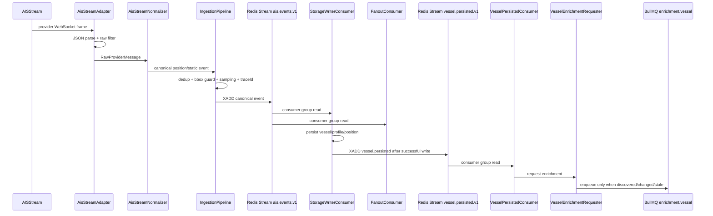
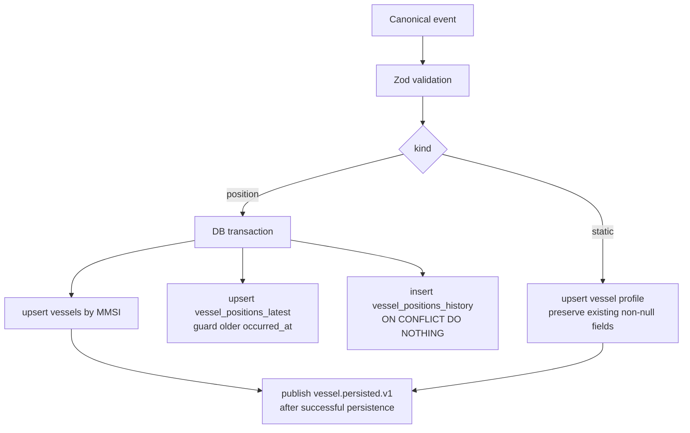
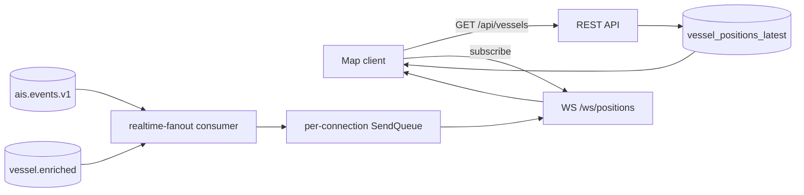
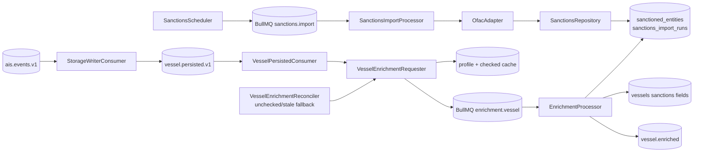

# AIS Tracking System - Architecture Review

## Project Overview

AIS Tracking System is a backend-heavy maritime intelligence platform. It
ingests live AIS vessel traffic from AISStream, normalizes provider-specific
frames into a stable internal contract, persists geospatial state in PostGIS,
enriches vessel profiles against locally imported sanctions data, and delivers
REST plus WebSocket APIs to a MapLibre frontend.

The system is useful for analysts, operators, or portfolio reviewers who need
to understand vessel movement, current location, historical tracks, and
sanctions risk in near real time. The interesting engineering problem is not
rendering vessel markers; it is building a reliable event pipeline around a
high-volume, lossy, externally sourced live feed while preserving operational
visibility and clear module boundaries.

Architecturally, this is a role-sliced modular monolith. The codebase runs as
one NestJS application in local development, but process roles (`api`,
`ingestion`, `worker`, `all`) define future service extraction boundaries. The
backend uses Redis Streams for durable internal events, BullMQ for worker jobs,
PostGIS for spatial persistence, and Prometheus/Grafana for operational
feedback.

## Architecture Overview

### Main Modules

| Module                 | Responsibility                                            | Primary Dependencies                   |
| ---------------------- | --------------------------------------------------------- | -------------------------------------- |
| `shared/config`        | Zod-backed environment validation and typed config access | process env                            |
| `shared/logger`        | pino structured logging and trace correlation helpers     | nestjs-pino                            |
| `shared/db`            | PostgreSQL client lifecycle                               | `postgres`, Drizzle                    |
| `shared/redis`         | Redis client lifecycle                                    | ioredis                                |
| `shared/bus`           | Event bus abstraction and Redis Streams implementation    | Redis Streams                          |
| `shared/queue`         | BullMQ integration                                        | Redis                                  |
| `shared/metrics`       | Prometheus metrics, HTTP interceptor, stream lag probes   | prom-client                            |
| `shared/health`        | Liveness/readiness and provider degradation reporting     | DB, Redis, provider registry           |
| `ingestion`            | Provider lifecycle, raw filtering, provider normalization | AISStream WebSocket                    |
| `pipeline`             | Deduplication, sampling, bbox filtering, publishing       | Redis, EventBus                        |
| `storage`              | Vessel state persistence and query repository             | Postgres/PostGIS                       |
| `api`                  | Public REST surface                                       | storage/enrichment repositories        |
| `admin`                | Operational controls: streams, DLQ, sanctions imports     | Redis, EventBus, BullMQ                |
| `realtime`             | WebSocket gateway and event fanout                        | Redis Streams, in-memory subscriptions |
| `enrichment/sanctions` | OFAC import, source metadata, import audit                | BullMQ, Postgres                       |
| `enrichment/vessel`    | Per-vessel screening and enriched-event publication       | BullMQ, Postgres, Redis                |
| `web`                  | Map client with REST bootstrap and WS live merge          | React, MapLibre                        |

### Ownership Boundaries

The strongest ownership boundaries are around event contracts and data access:

- Ingestion owns provider-specific transport, raw schema quirks, filtering, and
  conversion into canonical AIS events.
- Pipeline owns feed quality controls before downstream consumers see events.
- Storage owns PostGIS writes, snapshot queries, detail queries, and track
  queries.
- Realtime owns connection lifecycle, subscription state, backpressure, and
  message delivery semantics.
- Enrichment owns sanctions import data, matching rules, job idempotency, and
  sanctions status updates.
- API/admin modules expose use cases but do not own persistence details.

The system avoids a shared "service soup" by routing cross-module communication
through Redis Streams or narrow repository interfaces.

## Communication and Data Flow

### Ingestion to Consumers

### Storage Write Path

### Realtime Flow

### Sanctions and Enrichment Flow

## Technology Stack

- Backend: Node.js 22, TypeScript, NestJS.
- Database: PostgreSQL 16 with PostGIS; Drizzle schema and migrations.
- Messaging: Redis Streams for canonical events; BullMQ for scheduled/background jobs.
- Validation: Zod for environment config, API queries, canonical contracts, and WS protocol.
- Realtime: raw `ws` WebSocket server attached to the Nest HTTP server.
- Observability: pino JSON logs, Prometheus metrics, Grafana provisioning.
- Frontend: React, Vite, MapLibre GL, Zustand, React Query, Tailwind.
- Testing: Jest/ts-jest/Supertest for backend; Vitest/Testing Library for frontend.
- Deployment/dev: Dockerfile and Docker Compose for Postgres, Redis, app, Prometheus, Grafana.

## Engineering Patterns and Decisions

### Modular Monolith with Role Slicing

`AppModule.forRole()` composes modules by process role. This is a strong MVP
choice: it keeps local development simple while making operational boundaries
visible. The chosen roles map cleanly to likely scaling axes: API/realtime,
ingestion, and worker workloads.

Tradeoff: code still shares one deployment artifact and one repository. That is
appropriate at this scale, but module boundaries must remain disciplined to
avoid making later extraction expensive.

### Event-Driven Internal Pipeline

Canonical AIS events are published to `ais.events.v1`, and storage and realtime
consume them via independent Redis consumer groups. Enrichment dispatch no
longer consumes canonical AIS events directly: after storage successfully
persists a vessel write, it publishes a post-persistence domain event to
`vessel.persisted.v1`, which `VesselPersistedConsumer` validates before calling
`VesselEnrichmentRequester`. This decouples the provider connection from
downstream latency while ensuring enrichment decisions are based on
storage-confirmed vessel facts.

Redis Streams are a pragmatic fit for the documented scale envelope. They are
lighter than Kafka/RabbitMQ and support replay, consumer groups, pending
message recovery, and DLQ workflows. The tradeoff is operational: retention and
memory sizing matter, and Redis AOF every second accepts a small loss window.

This is not a classic transactional outbox implementation. Canonical AIS events
are still produced before storage writes, and the `vessel.persisted.v1`
handoff is a best-effort post-commit publish. A crash between DB commit and
publish can miss the immediate enrichment request, so the worker-side
`VesselEnrichmentReconciler` periodically scans unchecked or stale vessels and
calls the same requester. That is a deliberate tradeoff: sanctions status is
derived state, and the reconciler gives correctness without adding outbox
tables, dispatchers, and cleanup for this iteration.

### Contract Validation

Canonical `position`, `static`, `vessel.persisted`, and `vessel.enriched`
events are Zod schemas. Consumers re-validate messages before acting. This matters because Redis
Streams become a long-lived boundary: bad payloads should fail close to the
consumer with observable handling instead of corrupting storage or client state.

### Deduplication and Sampling

Deduplication is keyed by `(mmsi, occurredAt)` using Redis `SET NX` with TTL.
Sampling uses per-MMSI Redis state and allows different windows for moving and
stationary vessels, with a navigation-status bypass. Applying these controls
before publish means every downstream consumer sees the same cleaned feed.

This reduces storage load, realtime fanout pressure, and enrichment churn. The
main tradeoff is intentional information loss: consumers cannot recover sampled
points from the canonical stream.

### Transactional Storage Writes

Position handling writes identity, latest position, and history in one database
transaction. History insertion is idempotent through `(vessel_id, occurred_at)`,
and the latest-position upsert ignores older events. These are meaningful
production signals for stream replay and out-of-order delivery.

`vessel_positions_latest` functions as a read model optimized for map snapshots,
while `vessel_positions_history` remains the append-oriented history source.
This is CQRS-like in access-pattern separation, but the project does not
introduce a separate command model or CQRS framework.

### Dead Letter Handling

`RedisStreamsEventBus` acknowledges only after handler success. Handler errors
increment Redis retry counters, leave messages pending for retry, and eventually
publish a DLQ envelope to `ais.deadletter`. `XAUTOCLAIM` recovers stuck pending
messages from dead consumers. Admin endpoints can list and replay DLQ entries.

This is one of the strongest reliability patterns in the project because it
addresses poison messages, consumer crashes, and manual recovery.

### Realtime Backpressure

The WebSocket gateway uses a bounded `SendQueue` per connection. Position
messages are stored by MMSI so newer positions supersede older queued positions,
while static and enrichment messages are not silently dropped. A full queue of
non-droppable messages disconnects the slow client.

This is a practical realtime design: position updates are state replacement, not
an immutable audit stream, but profile/enrichment events are semantically
important and should not disappear quietly.

### Sanctions as Local ETL

The system imports OFAC SDN vessel data into local tables and matches vessels
locally. This avoids per-vessel external API calls on the hot path, makes
matching auditable, and allows enrichment to run asynchronously.

The current matcher is intentionally conservative: exact IMO, exact MMSI, then
normalized name as a candidate signal. This reduces false positives for a
portfolio-grade MVP while leaving room for richer scoring later.

### Idempotent Enrichment

`VesselEnrichmentRequester` computes a profile hash and uses deterministic
BullMQ job IDs. The worker applies a freshness-guarded database update and only
publishes `vessel.enriched` after the update is accepted. Redis cache keys
suppress unnecessary repeated checks until the checked-key TTL expires.

The reconciler is scoped to persisted vessels whose sanctions state is missing
or stale. Profile changes for fresh vessels are normally detected by the
post-persistence `vessel.persisted.v1` event flow; if that immediate event is
missed, the vessel will still be rechecked once it becomes stale.

This design matters because live AIS feeds can repeat, arrive out of order, or
learn vessel profile fields gradually.

## Database Architecture

The database model separates access patterns:

- `vessels`: identity, static profile, sanctions state.
- `vessel_positions_latest`: one current position per vessel for map snapshots.
- `vessel_positions_history`: append-only time-series position history,
  partitioned by UTC day with a rolling 7-day retention window plus safety
  buffer.
- `sanctioned_entities`: source-owned sanctions entities with indexes on IMO,
  MMSI, name, and aliases.
- `sanctions_import_runs`: import audit and operational visibility.

PostGIS `geometry(Point, 4326)` is a good choice for bbox/map workloads. The
repository uses `ST_MakeEnvelope` for coverage queries and `ST_MakeLine` plus
`ST_SimplifyPreserveTopology` for simplified tracks.

## Public APIs and Contracts

REST APIs are intentionally narrow:

- `GET /api/vessels` returns a bounded latest snapshot.
- `GET /api/vessels/:id` returns full profile, current position, and sanctions detail.
- `GET /api/vessels/:id/track` returns bounded historical tracks.
- `GET /api/sanctions/sources` exposes source metadata and last import status.
- health, readiness, and metrics are first-class operational endpoints.

Admin APIs expose DLQ replay, stream inspection, and sanctions import operations
behind a token guard.

The WebSocket protocol is similarly small: clients send only `subscribe`; the
server owns coverage and publishes typed event envelopes.

## Observability

The project has unusually complete observability for a portfolio system:

- JSON logs with `traceId`, MMSI, stream, consumer group, and provider fields.
- Prometheus metrics for raw messages, published events, drop reasons, provider
  health, stream lag, pending messages, handler latency/errors, DLQ volume, DB
  query latency, DB writes, enrichment outcomes, sanctions imports, WS activity,
  and HTTP latency.
- Grafana and Prometheus are provisioned in Docker Compose.
- `/readyz` distinguishes infrastructure readiness from provider feed degradation.

This gives reviewers evidence that the author understands operational behavior,
not only happy-path code.

## Testing Strategy

The repository has broad unit-level coverage across backend and frontend:

- provider registry, AISStream raw filtering, normalization, and backoff;
- deduplication, sampling, and pipeline behavior;
- Redis Stream DLQ/failure handling;
- health/config/logger/metrics helpers;
- REST controllers and admin guard behavior;
- storage writer and repository behavior;
- realtime protocol, subscription service, gateway, and send queue;
- sanctions OFAC parsing, import command, matcher, persisted-event enrichment requester/repository;
- frontend WebSocket client, merge reducer, map hooks, labels, colors, and UI components.

The main gap is integration coverage around real Postgres/Redis behavior. The
design has many integration-sensitive promises: transactions, partitioned
history writes, DLQ replay, BullMQ scheduling, and slow-client realtime
behavior. Unit tests are useful here, but they cannot fully prove production
semantics.

## Codebase Quality Review

### Strengths

- Clear modular ownership. Modules map to real bounded responsibilities and are
  composed by process role instead of being globally entangled.
- Production-aware event handling. Redis Streams consumer groups, pending
  recovery, retries, DLQ, and replay endpoints show mature backend judgment.
- Good contract discipline. Zod validation appears at config, API, WS, and event
  boundaries.
- Access-pattern-driven storage. Latest state, history, and vessel identity are
  separated rather than forced into one table.
- Realtime backpressure is explicitly designed. The queue semantics match the
  domain: position events are supersedable; static/enrichment events are not.
- Enrichment avoids hot-path external dependencies. Local sanctions ETL is more
  reliable and auditable than querying a third party per vessel.
- Observability is comprehensive for the system size. Metrics and structured
  logs cover the pipeline end to end.
- Frontend/backend interaction is coherent. The frontend bootstraps from REST
  and applies WS deltas, which is a standard and scalable realtime pattern.

### Potential Improvements / Risks

| Issue                                                          | Severity | Why It Matters                                                                                                                                                                                                                       | Recommendation                                                                                                                             |
| -------------------------------------------------------------- | -------- | ------------------------------------------------------------------------------------------------------------------------------------------------------------------------------------------------------------------------------------ | ------------------------------------------------------------------------------------------------------------------------------------------ |
| Historical partition lifecycle requires operational monitoring | Medium   | Daily partition maintenance is now automated, but production deployments still need alerts if maintenance fails or future partitions run low.                                                                                        | Add runbook checks and alerts for missing today/tomorrow partitions and failed maintenance runs.                                           |
| Name/alias sanctions lookup remains basic                      | Medium   | The current worker uses indexed identifier lookups first and then a narrow name/alias fallback. That is much better than full-table scans, but richer fuzzy/transliteration matching is still out of scope.                         | Add normalized-name materialization and scored fuzzy matching only after exact identifiers, preserving candidate/manual-review semantics. |
| Realtime subscriptions are in memory                           | Medium   | Multiple API/realtime replicas would each see only their own connected clients while Redis consumer groups distribute events among consumers. Horizontal scaling could cause missed fanout unless each replica receives every event. | For multi-replica realtime, use Redis Pub/Sub or a dedicated broadcast stream/channel between stream consumers and WS pods.                |
| Redis Streams retention is approximate and finite              | Medium   | `MAXLEN ~ 100k` bounds memory but also bounds replay. A lagging consumer can lose events if trim outruns it.                                                                                                                         | Alert on stream lag versus retention, size `STREAM_MAXLEN` from peak throughput and recovery target, and document acceptable loss windows. |
| Integration test gaps remain                                   | Medium   | The most production-critical behavior spans Redis, BullMQ, and Postgres. Unit tests do not fully prove transaction, partition, replay, and worker semantics.                                                                         | Add Testcontainers or Docker-backed integration suites for storage, DLQ replay, sanctions import, enrichment loop, and realtime overflow.  |
| API documentation is manual                                    | Medium   | REST/WS contracts are clear in code, but recruiters and integrators benefit from machine-readable contracts.                                                                                                                         | Add OpenAPI for REST and a small schema document for WS event envelopes. Consider generated frontend types.                                |
| Public API has no auth/rate limiting                           | Medium   | Acceptable for local/demo use, risky if deployed publicly. Snapshot endpoints can be expensive under unbounded traffic.                                                                                                              | Add rate limiting and optional auth/API key middleware for public deployments.                                                             |
| Metrics labels need cardinality discipline as the system grows | Low      | Current labels are mostly bounded, but future query/error labels can accidentally create high-cardinality metrics.                                                                                                                   | Keep route/query labels normalized and review new metrics for cardinality.                                                                 |
| Sanctions name matching is intentionally conservative          | Low      | Exact normalized names reduce false positives but may miss spelling variants, transliteration, and common vessel renames.                                                                                                            | Add scored fuzzy matching only after exact identifiers and preserve candidate/manual-review semantics.                                     |
| Dockerfile builds backend only                                 | Low      | Good for backend roles, but full demo deployment still requires separate frontend serving strategy.                                                                                                                                  | Add a documented frontend build/serve path or compose profile for the web app if the portfolio demo should be one command.                 |

## Scalability Considerations

The system is appropriate for the documented envelope of hundreds of messages
per second and roughly one thousand peak. The key scaling paths are visible:

- Run `ingestion`, `api`, and `worker` roles separately.
- Increase storage writer/enrichment consumers carefully by consumer group.
- Keep PostGIS indexes healthy and partition history by time.
- Size Redis Stream retention based on peak throughput and recovery objectives.
- Introduce a realtime broadcast layer before horizontally scaling WS replicas.
- Add richer normalized-name/fuzzy sanctions matching while keeping exact IMO/MMSI priority.

The design avoids premature infrastructure while preserving credible migration
paths.

## Security Considerations

Positive signals:

- Environment validation fails fast.
- Admin routes use a token guard and timing-safe comparison.
- Admin endpoints are disabled outside development when `ADMIN_TOKEN` is unset.
- Query params and IDs are validated before repository calls.
- Parameterized SQL is used through Drizzle `sql` templates.

Risks to address before public exposure:

- Add auth/rate limiting for public APIs.
- Restrict CORS/origin policy if serving outside trusted local environments.
- Protect Grafana/Prometheus in real deployments.
- Treat AISStream and sanctions source configuration as secrets/config maps.
- Add API request-size limits and explicit WebSocket connection limits.

## Developer Experience and Maintainability

DX is strong: scripts cover build, lint, typecheck, tests, migrations, partitions,
and web build/dev. The code reads as a series of vertical slices with tests near
the modules they verify. The main maintainability challenge is that several
repositories use hand-written SQL for PostGIS and upsert behavior. That is
reasonable, but these queries deserve integration tests because type-level
coverage is weaker than Drizzle's fluent query builder.

## Production Readiness Summary

This repository demonstrates several senior-level engineering instincts:

- asynchronous internal boundaries;
- explicit failure handling;
- idempotent writes;
- operational dashboards;
- role-based deployment;
- bounded realtime resources;
- local ownership of enrichment data;
- careful contract validation.

The main production-readiness gaps are not conceptual; they are operational
hardening items: partition automation, indexed enrichment lookup, multi-replica
realtime fanout, public-edge security, and integration tests over real
infrastructure.

## Recommended Roadmap

1. Add integration tests for PostGIS writes, history partitions, track queries,
   DLQ replay, and BullMQ enrichment.
2. Add production alerts/runbook checks for history partition maintenance.
3. Add normalized-name materialization and richer candidate scoring for sanctions matching.
4. Add OpenAPI and generated client types.
5. Add public API rate limiting and deployment security notes.
6. Add a realtime broadcast layer for horizontally scaled API replicas.
7. Implement OpenSanctions as a second sanctions adapter.
8. Add a one-command demo profile that serves backend, frontend, and observability.

## README Generation Notes

The repository README has been rewritten to present the system as a mature
portfolio backend project. It preserves useful operational details from the old
README, removes the stale "walking skeleton" status, and adds architecture,
workflow, API, setup, observability, testing, and roadmap sections suitable for
recruiters and senior engineering reviewers.
