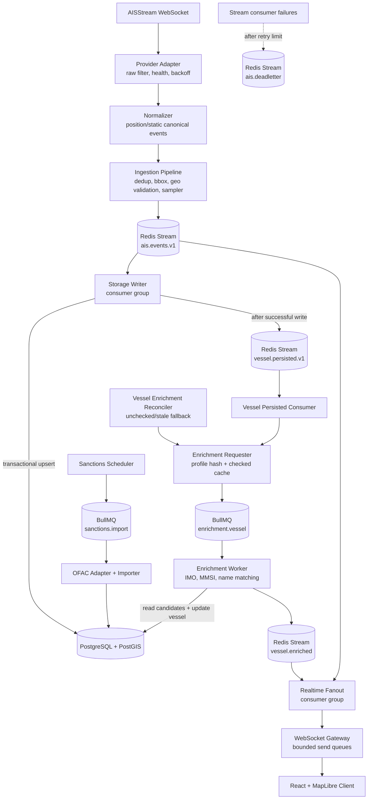
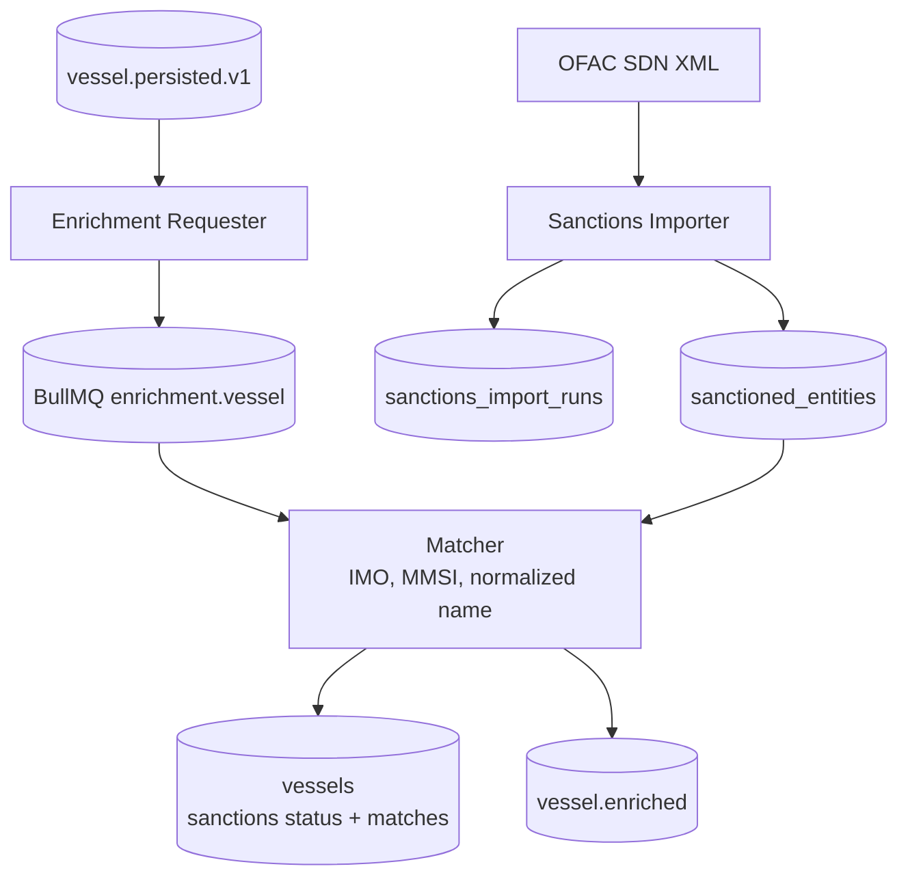

# Architecture Overview

This document contains the deeper architecture detail intentionally kept out of the README. The README diagram is optimized for fast scanning; this page documents the internal event flows and operational mechanics.

## Runtime Shape

The backend is a modular NestJS application that can run as a single local process or as role-based containers from the same image:

| Role | Modules |
| --- | --- |
| `all` | API, admin, ingestion, pipeline, storage, enrichment, realtime |
| `api` | REST API, admin controllers, health/readiness, WebSocket gateway |
| `ingestion` | provider ingestion, normalization pipeline, storage writer |
| `worker` | sanctions import, vessel enrichment, reconciliation jobs |

## Detailed Event Flow

## Redis Streams and Failure Handling

- `ais.events.v1` carries canonical position/static events.
- `vessel.persisted.v1` carries post-storage vessel facts for enrichment.
- `vessel.enriched` carries sanctions enrichment results for realtime fanout.
- `ais.deadletter` stores poison messages with original stream metadata.

Consumers acknowledge only after handler success. Handler failures on subscribed streams are retried through pending-message recovery, reclaimed with `XAUTOCLAIM`, and moved to DLQ after the configured retry limit. DLQ entries can be inspected and manually replayed through admin endpoints.

## Storage Model

PostGIS tables are split by access pattern:

- `vessels`: vessel identity, profile fields, and sanctions status.
- `vessel_positions_latest`: one current geospatial row per vessel for map snapshots.
- `vessel_positions_history`: append-only daily partitions for tracks.
- `sanctioned_entities`: locally imported sanctions candidates.
- `sanctions_import_runs`: import audit records.

Position writes run in a transaction: upsert vessel identity, upsert latest position, append history. Latest upserts use an `occurred_at` guard for out-of-order protection, and history inserts are idempotent on `(vessel_id, occurred_at)`.

After a position or static event is persisted, `StorageWriterConsumer` publishes a `vessel.persisted` event to `vessel.persisted.v1`. That event is the post-storage handoff into enrichment. If publishing this handoff fails, the storage write is not rolled back; the failure is logged and enrichment reconciliation can recover stale or unchecked vessels later.

## Realtime Delivery

The frontend loads an initial snapshot from `GET /api/vessels`, then subscribes to `WS /ws/positions`.

Each WebSocket connection has a bounded queue:

- position events are coalesced by MMSI;
- static and enrichment messages are preserved;
- clients that cannot drain fast enough are disconnected.

This keeps realtime fanout predictable under bursty AIS traffic.

## Enrichment Workflow

Sanctions data is imported locally rather than queried per vessel at runtime.

The enrichment requester owns enqueue decisions using profile hashes and checked-cache entries. Jobs use deterministic IDs, and database updates use freshness guards so replayed or delayed jobs do not overwrite newer checks.

## Geo Validation

The ingestion pipeline can validate positions against imported PostGIS land/water datasets before publishing downstream events.

- Configurable fail-open/fail-closed behavior supports safe rollout.
- Redis caching reduces repeated validation cost.
- Metrics expose validation verdicts, sources, cache behavior, and active dataset version.

## Observability

The system exposes metrics for:

- ingestion received/published/dropped counts;
- Redis stream lag, pending entries, handler latency, and handler errors;
- DLQ totals;
- DB query duration and write counts;
- geo validation verdicts and cache results;
- sanctions import duration and records;
- enrichment job outcomes and match types;
- HTTP latency and WebSocket behavior.

Structured logs carry correlation data such as `traceId`, MMSI, stream, consumer group, and stream message ID where applicable.
