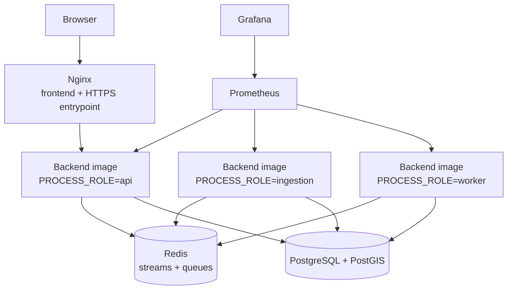
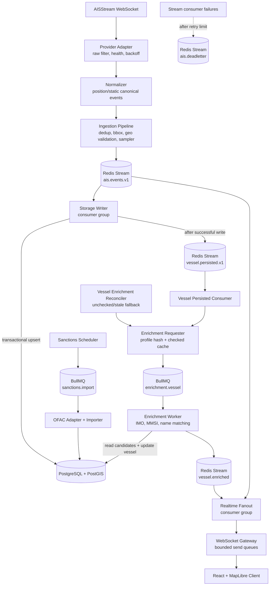
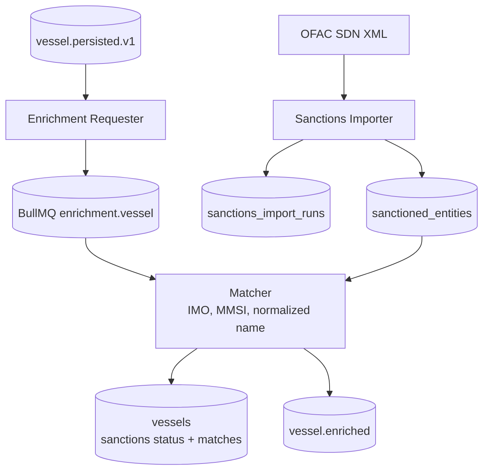

# Architecture Overview

This document contains the deeper architecture detail intentionally kept out of the README. The README diagram is optimized for fast scanning; this page documents the internal event flows and operational mechanics.

## Runtime Shape

The backend is a modular NestJS application that can run as a single local process or as role-based containers from the same image:

| Role        | Active modules                                                                                            |
| ----------- | --------------------------------------------------------------------------------------------------------- |
| `all`       | API, admin, ingestion, pipeline, storage writer, enrichment, realtime                                     |
| `api`       | REST API, admin controllers, health/readiness, realtime gateway and fanout consumers                      |
| `ingestion` | provider ingestion, normalization pipeline, geo validation, storage writer, history partition maintenance |
| `worker`    | sanctions import, vessel enrichment requester/processor, persisted-event consumer, reconciliation jobs    |

Shared infrastructure modules for config, logging, metrics, DB, Redis, event bus, queues, and health are loaded for every role. API/admin routes import storage and sanctions repositories for reads/admin commands, but the storage writer runs only in `all` and `ingestion`; enrichment workers run only in `all` and `worker`.

## Architecture Principles

- Keep the backend as a modular monolith until operational pressure justifies distribution.
- Use event-driven internal boundaries where storage, realtime, and enrichment need isolation.
- Treat enrichment as asynchronous derived state, not part of the ingestion write path.
- Use PostGIS as the system of record for vessel identity, latest state, history, and sanctions results.
- Prefer operational simplicity before adding distributed-system complexity.

## Deployment Topology

The current production topology runs on a single VM with Docker Compose. Nginx is the public entrypoint and serves the frontend while proxying API and WebSocket traffic to the API role. API, ingestion, and worker containers are created from the same backend image and select behavior through `PROCESS_ROLE`.

One-shot migration and geo-import containers run alongside this topology when needed. Deployment and recovery procedures are covered in the operations runbooks.

## Detailed Event Flow

## Redis Streams and Failure Handling

- `ais.events.v1` carries canonical position/static events.
- `vessel.persisted.v1` carries post-storage vessel facts for enrichment.
- `vessel.enriched` carries sanctions enrichment results for realtime fanout.
- `ais.deadletter` stores poison messages with original stream metadata.

Consumers acknowledge only after handler success. Handler failures on subscribed streams are retried through pending-message recovery, reclaimed with `XAUTOCLAIM`, and moved to DLQ after the configured retry limit. DLQ entries can be inspected and manually replayed through admin endpoints.

## Storage Model

PostGIS tables are split by access pattern:

- `vessels`: vessel identity, profile fields, and sanctions status.
- `vessel_positions_latest`: one current geospatial row per vessel for map snapshots.
- `vessel_positions_history`: append-only daily partitions for tracks.
- `sanctioned_entities`: locally imported sanctions candidates.
- `sanctions_import_runs`: import audit records.

Position writes run in a transaction: upsert vessel identity, upsert latest position, append history. Latest upserts use an `occurred_at` guard for out-of-order protection, and history inserts are idempotent on `(vessel_id, occurred_at)`.

After a position or static event is persisted, `StorageWriterConsumer` publishes a `vessel.persisted` event to `vessel.persisted.v1`. That event is the post-storage handoff into enrichment. If publishing this handoff fails, the storage write is not rolled back; the failure is logged and enrichment reconciliation can recover stale or unchecked vessels later.

## Realtime Delivery

The frontend loads an initial snapshot from `GET /api/vessels`, then subscribes to `WS /ws/positions`. The realtime fanout consumers read canonical AIS events and enrichment results from Redis Streams and send them through bounded WebSocket queues.

See [realtime.md](realtime.md) for client protocol, queue behavior, and fanout details.

## Enrichment Workflow

Sanctions data is imported locally rather than queried per vessel at runtime. Persisted vessel facts trigger asynchronous enrichment jobs, and completed checks update Postgres before publishing `vessel.enriched` for realtime clients.

See [sanctions-enrichment.md](sanctions-enrichment.md) for source handling, matching rules, job idempotency, and recovery behavior.

## Geo Validation

Geo validation is an optional ingestion-stage guard that can reject impossible or low-quality vessel positions before they reach the shared event stream. It runs after provider/bbox filtering and before sampling and publishing to `ais.events.v1`.

See [geo-validation.md](geo-validation.md) for dataset handling, caching, rollout modes, metrics, and operational details.

## Observability

The system exposes metrics for:

- ingestion received/published/dropped counts;
- Redis stream lag, pending entries, handler latency, and handler errors;
- DLQ totals;
- DB query duration and write counts;
- geo validation verdicts and cache results;
- sanctions import duration and records;
- enrichment job outcomes and match types;
- HTTP latency and WebSocket behavior.

Structured logs carry correlation data such as `traceId`, MMSI, stream, consumer group, and stream message ID where applicable.
