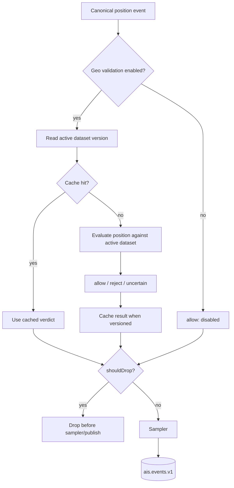

# Geo Validation

Geo validation is an optional ingestion-stage guard for AIS positions. It uses imported PostGIS geospatial datasets to decide whether a position should continue through the pipeline or be dropped before it reaches shared Redis Streams.

The subsystem answers one question: is this position plausible enough to publish?

## Where It Runs

Validation is invoked from the ingestion pipeline after provider normalization, deduplication, and configured coverage bbox checks. Static AIS events bypass geo validation because they do not carry a position.

```text
raw provider message -> normalizer -> dedup -> bbox -> geo validation -> sampler -> ais.events.v1
```

## Validation Flow



The validation service receives latitude, longitude, MMSI, provider, and trace ID. It first checks whether validation is enabled. If enabled, it looks up the active dataset version, attempts a cache read for that version and coordinate bucket, and falls back to PostGIS evaluation on a cache miss.

The result carries a verdict, reason, dataset version, and `shouldDrop` flag. The ingestion pipeline only uses `shouldDrop` to decide whether to stop processing. Positions that are not dropped continue to the sampler and may then be published to `ais.events.v1`.

## Verdict Model

The implemented verdict categories are:

- `allow`: the position is acceptable for the pipeline.
- `reject`: the position failed validation.
- `uncertain`: the position is close enough to land or otherwise ambiguous enough that the system should preserve it.

Current ingestion behavior is reason-aware:

- `reject` with `deep_land` drops the event as `on_land`.
- `reject` with `geo_validation_error` drops the event as `geo_validation_error` when fail-closed behavior is configured.
- `uncertain` does not drop; it continues through sampling and publish.
- `allow` does not drop.

Validation errors are controlled by `GEO_VALIDATION_FAIL_OPEN`. In fail-open mode, errors become an `allow` result with reason `geo_validation_error`. In fail-closed mode, errors become a droppable `reject` with the same reason.

If validation is disabled, the service returns `allow` with reason `disabled` and does not query PostGIS or Redis cache.

## Dataset Model

Geo datasets are stored in PostGIS under versioned dataset records. At validation time, the subsystem uses the currently active dataset version only.

Conceptually, an imported dataset contains:

- land polygons;
- navigable-water polygons;
- manual allow overrides;
- dataset metadata such as version, coverage margin, and coastal tolerance.

Manual overrides are repository-owned allow polygons. They are evaluated before navigable-water and land checks, so known valid areas can be preserved even when imported datasets are incomplete.

The evaluation order is:

1. Invalid coordinate guard.
2. Active dataset lookup.
3. Manual allow override.
4. Navigable-water allow.
5. Coastal-tolerance uncertainty.
6. Deep-land rejection.
7. Default allow when the point is not on known land.

If no dataset is active, validation allows the position with reason `dataset_unavailable`.

## Caching

Redis caching reduces repeated PostGIS work for nearby repeated positions. Cache entries are scoped to the active dataset version and a coordinate bucket based on configured precision, so activating a new dataset naturally uses a different cache namespace.

The cache stores structured validation results, not raw geometries. Cached hits return before PostGIS evaluation. Results with an `uncertain` verdict use a shorter TTL than ordinary allow/reject results so ambiguous coastal cases are refreshed more often.

If cache reads or writes fail, validation logs the cache error, records cache-error metrics, and continues through the non-cache path.

## Observability

The subsystem exposes metrics for:

- validation outcomes by verdict, reason, and source;
- cache hits, misses, disabled state, and cache errors;
- validation duration by source;
- the currently active dataset version.

The validation service also logs disabled validation once and logs validation/cache failures with available MMSI, provider, trace ID, dataset version, and coordinates. Pipeline-level drop metrics record geo drops as `on_land` or `geo_validation_error`.

## Operational Notes

This page describes subsystem behavior. Dataset import, activation, rollout, and recovery procedures belong in the operations docs.

Related docs:

- [Architecture overview](architecture.md)
- [Architecture decisions](architecture-decisions.md)
- [Operations runbook](../operations/operations-runbook.md)
