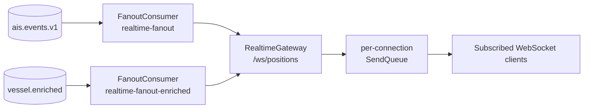

# Realtime Delivery

Realtime delivery keeps the React/MapLibre client current after its initial REST snapshot. The subsystem reads stored vessel events from Redis Streams and fans them out through a raw WebSocket gateway.

## Realtime Architecture

The realtime module contains three active pieces:

- `FanoutConsumer`: subscribes to Redis Streams and validates stream payloads.
- `RealtimeGateway`: owns WebSocket connections, heartbeat, per-client queues, and sends.
- `SubscriptionService`: tracks connection IDs that have sent a valid subscribe message.



The consumer reads canonical AIS events from `ais.events.v1`. Position events become realtime position messages; static events become realtime static messages. A second consumer group reads `vessel.enriched` and forwards enrichment updates.

The gateway is attached to the Nest HTTP server at `/ws/positions`. It does not query Postgres for live messages; the client gets its initial state from `GET /api/vessels` and then applies WebSocket deltas.

## Message Types

The realtime path emits four conceptual message categories:

- `position`: latest vessel position and movement fields from canonical position events.
- `static`: vessel profile fields from canonical static events.
- `vessel.enriched`: sanctions enrichment status and matches from enrichment workers.
- `error`: server-side protocol or queue errors sent to a single connection.

This page intentionally does not document payload schemas. The schemas are owned by the shared contracts and client protocol code, with API-level routing summarized in [../development/api.md](../development/api.md).

## Reliability Model

Realtime delivery is designed for a live map, not guaranteed per-client delivery of every intermediate position.

Each WebSocket connection has a bounded `SendQueue`. The queue has two behaviors:

- Position messages are keyed by MMSI. A newer position for the same MMSI supersedes the older queued position instead of growing the queue.
- Static and enrichment messages are kept in FIFO order and are not silently dropped.

When the queue is full:

- a new position can evict the oldest queued position for another vessel;
- if the queue contains no position that can be evicted, the enqueue fails;
- static and enrichment messages fail enqueue instead of being dropped.

On enqueue failure, the gateway sends a `QUEUE_OVERFLOW` error if the socket is still open, closes the connection with WebSocket code `1013`, removes the subscription, and decrements the active connection gauge. This protects the server from slow clients while preserving more important non-position updates.

Sends are also bounded by the socket's buffered amount. If the socket already has too many buffered bytes, the gateway leaves queued messages in memory and tries again when another message is enqueued. Heartbeat pings run on a configured interval. A connection that does not respond with `pong` by the next heartbeat tick is terminated and cleaned up.

Invalid stream payloads are logged and skipped by the fanout consumer. Invalid client messages receive an `error` message but do not automatically disconnect the client.

## Subscription Flow

Opening the WebSocket is not enough to receive events. The client must send:

```json
{ "type": "subscribe" }
```

Only that subscribe shape is accepted. Stale viewport payloads such as bbox subscriptions and `update_subscription` messages are rejected.

Subscriptions are global for the configured backend coverage. There is no per-client bbox, vessel, or viewport filter in the current protocol. Map pan and zoom change only the frontend camera; they do not change the WebSocket subscription and do not trigger REST refetches for the main marker layer.

The current web client sends `subscribe` when the socket opens and again after reconnect. It also refreshes the REST snapshot after a longer outage so the local store can recover from missed realtime messages.

## Scaling Considerations

The current design assumes a small number of API/realtime instances. Subscription state is in memory, and Redis consumer groups distribute stream messages among consumers. That is appropriate for the current single-VM topology and avoids an extra broadcast layer.

Before horizontally scaling multiple WebSocket gateway replicas, realtime fanout needs a distribution step that ensures every gateway instance receives events for its own connected clients. The current architecture decisions call out Redis Pub/Sub or a dedicated broadcast channel as the likely next layer when independent fanout scaling becomes necessary.

Related docs:

- [Architecture overview](architecture.md)
- [Architecture decisions](architecture-decisions.md)
- [API reference](../development/api.md)
