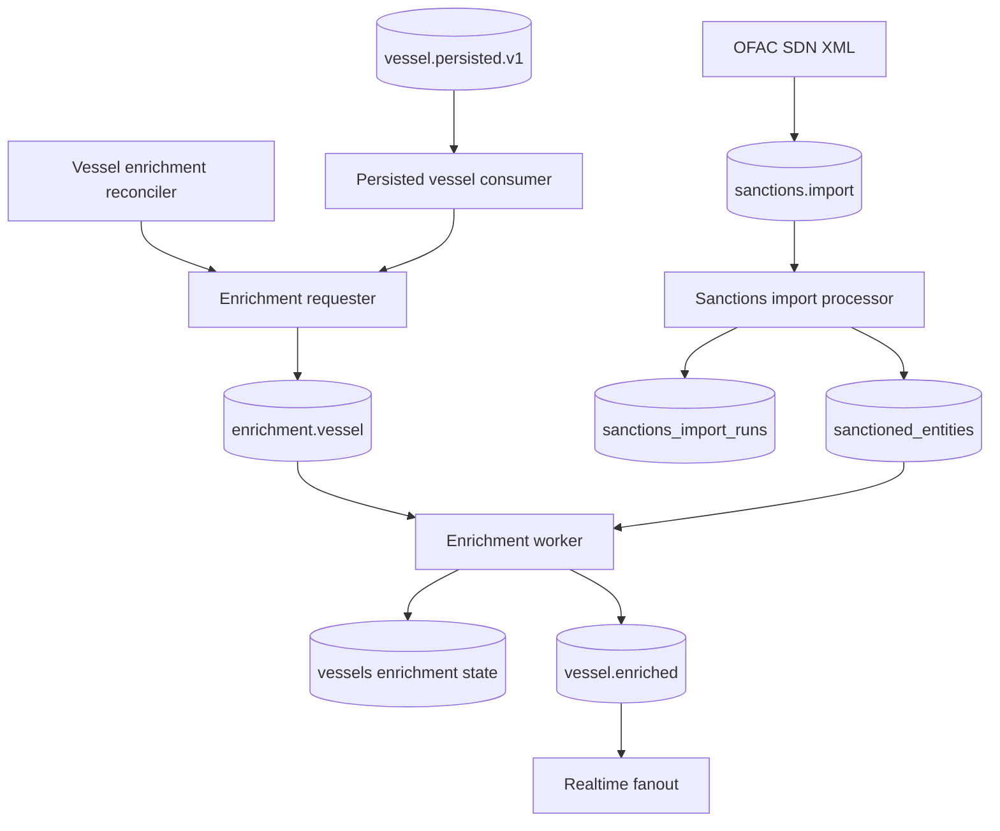

# Sanctions Enrichment

Sanctions enrichment is asynchronous derived state. The application imports sanctions data locally, matches persisted vessel profiles against that data, writes the enrichment result back to Postgres, and publishes realtime enrichment updates.

## Enrichment Architecture

The subsystem has two connected loops:

- **Sanctions import** loads OFAC SDN vessel entities through the `sanctions.import` queue and upserts them into local storage.
- **Vessel enrichment** reacts to persisted vessel events or reconciliation scans, enqueues enrichment work, matches the current vessel profile against the local sanctions dataset, and publishes a realtime update after a successful state write.

OFAC SDN XML is the implemented import source today. The importer filters the source feed to vessel entities and extracts the stable signals used by enrichment, including source entity ID, vessel name, IMO, MMSI, aliases, flag, listing programs, and the raw source payload.

## Data Model

The sanctions data model is intentionally local and auditable:

- **Imported sanctions entities** represent vessel records from the source feed. Each entity keeps source identity, vessel identifiers, names and aliases, flag, programs, listing date when available, and raw source data for traceability.
- **Import runs** record source, status, timing, record counts, and errors so operators can distinguish dataset freshness problems from enrichment problems.
- **Vessel enrichment state** lives on the vessel row as the current sanctions status, last checked timestamp, and match summary.
- **Enrichment matches** are stored as derived match results, not as independent review records. They preserve the source entity, match method, and display fields needed by the API and realtime clients.

## Enrichment Triggers

Enrichment is initiated after vessel state has been persisted, not inline during AIS ingestion. This keeps ingestion focused on durable vessel state and lets enrichment fail, retry, or lag without rolling back the primary AIS write.

The requester hashes the vessel profile from IMO and normalized name, then decides whether to enqueue work:

- `discovered`: no cached profile exists for the vessel.
- `profile_changed`: the cached profile hash differs from the current profile.
- `stale`: the profile hash is unchanged but the checked marker is missing.
- `fresh`: profile and checked marker are both present, so no job is enqueued.

Immediate requests come from `vessel.persisted.v1`. The reconciler also scans unchecked or stale vessels and sends them through the same requester path.

## Matching Strategy

Matching is deterministic and conservative:

1. IMO candidates are checked first.
2. MMSI candidates are checked next.
3. If any identifier match is found, the vessel is marked `sanctioned`.
4. Name and alias candidates are considered only when there is no identifier match.
5. Normalized exact name or alias matches are marked `candidate`.
6. If no candidate matches, the vessel is marked `clear`.

Identifier matches are treated as stronger evidence than name matches. Name matches remain candidate signals because vessel names are less stable and more collision-prone than IMO or MMSI. Results are deduplicated by sanctions entity and sorted deterministically so repeated processing produces stable output.

Current limitations are intentional: there is no fuzzy scoring, no manual review workflow, and no multi-source reconciliation beyond the implemented OFAC source.

## Recovery and Reconciliation

The immediate path handles the common case: a persisted vessel event reaches the requester, the requester enqueues an enrichment job, and the worker writes the result.

The reconciler covers gaps that the immediate path cannot fully guarantee. It runs at startup and on an interval, selects unchecked or stale vessels, and routes them through the same requester. This helps recover from missed persisted events, expired checked markers, worker downtime, or enrichment jobs that failed before a fresh state was written.

Jobs use deterministic IDs based on vessel ID, trigger, and profile hash. Database writes are guarded by `sanctions_checked_at` freshness so replayed or delayed jobs do not overwrite newer enrichment state. If the guard rejects a delayed write, the worker treats the job as a no-op and does not publish a realtime update.

## Realtime Updates

After the worker successfully applies an enrichment result, it publishes a `vessel.enriched` event. The realtime fanout consumer subscribes to that stream and forwards enrichment updates to connected clients.

Clients see sanctions status changes as part of the realtime update path, alongside persisted vessel state from the API. This document describes the subsystem flow only; detailed message shapes belong in the API and contract documentation.

## Observability

The subsystem exposes enough signal to separate source import health from vessel enrichment health:

- Import runs record success, failure, skipped-lock cases, record counts, and errors.
- Import metrics track duration and imported record volume by source.
- Enrichment metrics track job outcomes and produced match types.
- Repository metrics include database query timing and write counts for enrichment and import storage.
- Logs identify import scheduling, bootstrap behavior, import failures, invalid persisted events, skipped enrichment updates, completed enrichments, and reconciliation runs.

BullMQ provides operational visibility for queued and failed work. Enrichment jobs also use configured retry and backoff behavior so transient failures do not immediately become permanent enrichment gaps.

Related docs:

- [Architecture overview](architecture.md)
- [Architecture decisions](architecture-decisions.md)
- [API reference](../development/api.md)
